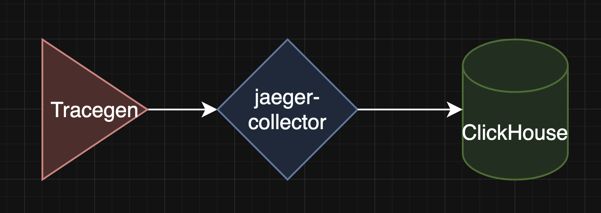
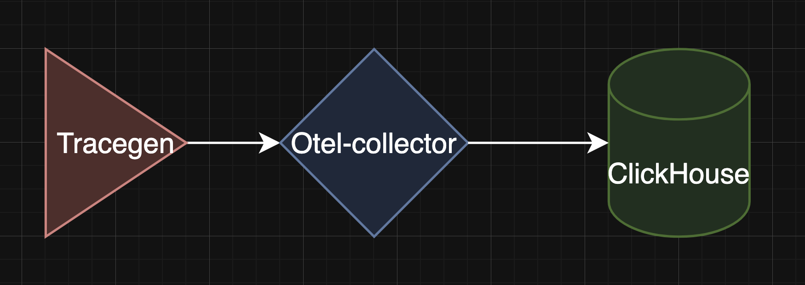

# Benchmark Database for Traces

## Project Structure

```

TracingBenchmark/
├── Makefile – launches the load testing
├── README.md
├── docker-compose-clkh.yaml – Setup for ClickHouse
├── docker-compose-monitoring.yaml – Setup for monitoring
├── docker-compose-os.yaml – Setup for OpenSearch
├── docker-compose-tempo.yaml – Setup for Tempo
├── docker-compose-victorialogs.yaml – Setup for VictoriaLogs
├── grafana – Initial Grafana setup for convenience
├── jaeger-clickhouse-binary – Jaeger plugin for ClickHouse
├── jaeger-clickhouse-collector – Source used in docker-compose-clkh.yaml
├── media – Media files
├── opensearch – OpenSearch configuration
├── opentelemetry-collector-contrib – Source code for tracegen
├── opentelemetry-demo – Information source
├── opentelemetry-demo-victorialogs – Information source
├── otel-collector – Otel-collector configurations
├── prometheus – Prometheus configurations
├── tempo – Tempo configuration
└── tracegen – Load generation mechanism

````

## Running Tests

Makefile
```Makefile
targets := os tempo victorialogs clkh

.PHONY: $(targets)

$(targets):
	echo "TARGET"="$@" > .env-target
	docker compose \
	-f docker-compose-monitoring.yaml \
	-f docker-compose-$@.yaml \
	--env-file .env-target --env-file .env \
	up --force-recreate --remove-orphans -d
````

Example for OpenSearch

```bash
make os
```

## Prerequisites

* Do not tune database parameters
* Database resource allocation: 2 CPUs / 4 GB RAM

## Component Diagrams

OpenSearch:


ClickHouse:



victorialogs:


Tempo:


## Intermediate Results

Your results may vary


## Sources

* [https://victoriametrics.com/blog/dev-note-distributed-tracing-with-victorialogs/](https://victoriametrics.com/blog/dev-note-distributed-tracing-with-victorialogs/)
* [https://github.com/VictoriaMetrics/VictoriaMetrics/issues/8148/](https://github.com/VictoriaMetrics/VictoriaMetrics/issues/8148/)
* [https://fosdem.org/2025/schedule/event/fosdem-2025-5960-o11y-in-one-exploring-a-unified-telemetry-database/](https://fosdem.org/2025/schedule/event/fosdem-2025-5960-o11y-in-one-exploring-a-unified-telemetry-database/)
* [https://clickhouse.com/blog/storing-traces-and-spans-open-telemetry-in-clickhouse/](https://clickhouse.com/blog/storing-traces-and-spans-open-telemetry-in-clickhouse/)

```
