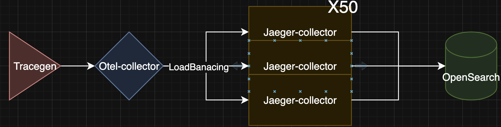
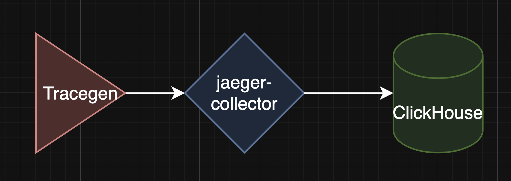
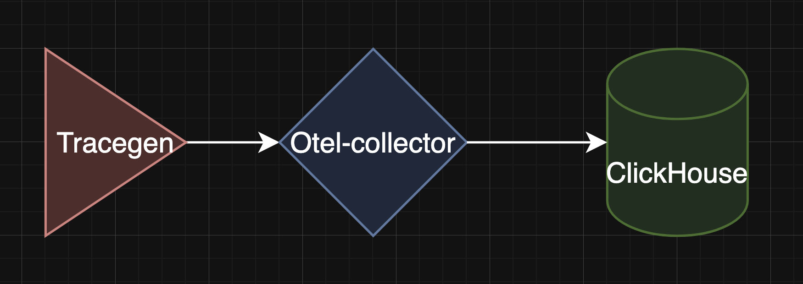
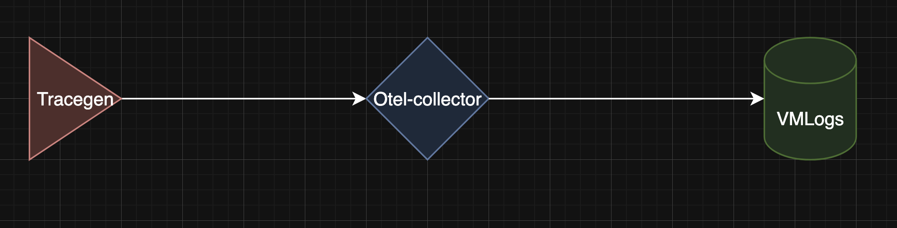
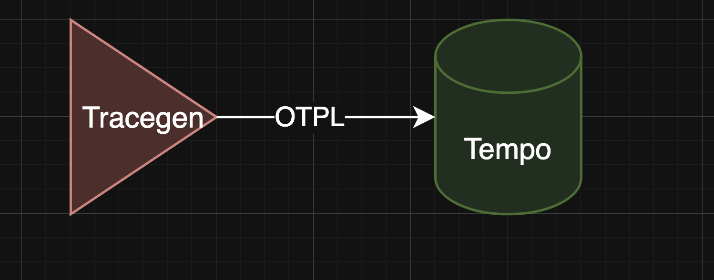
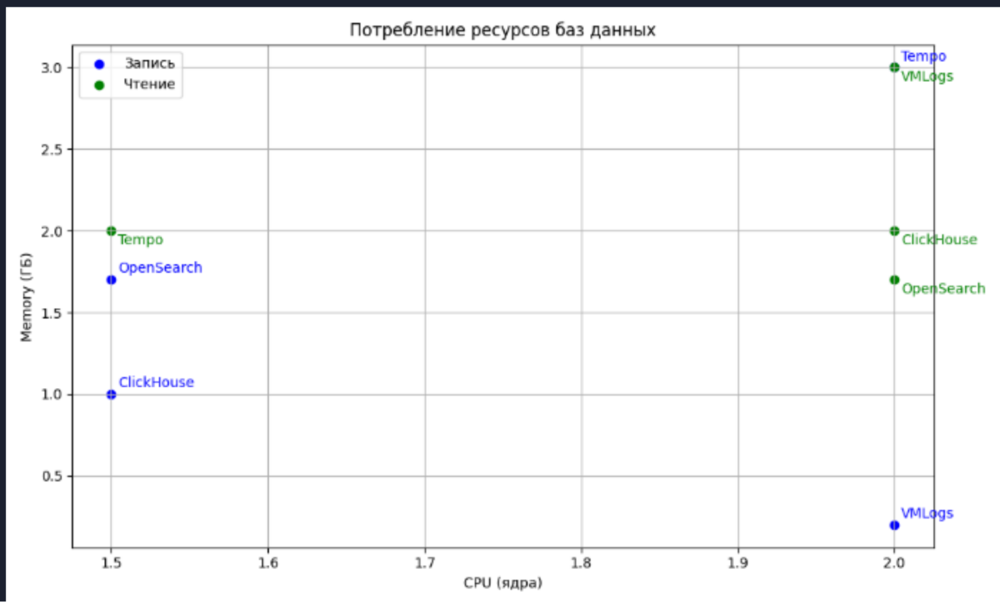

# Benchmark database for traces


## Структура проекта

```
TracingBenchmark/
├── Makefile запускает нагрузочное тестирование
├── README.md
├── docker-compose-clkh.yaml Структура для ClickHouse
├── docker-compose-monitoring.yaml Стриктура для мониторинга
├── docker-compose-os.yaml Структура для OpenSearch
├── docker-compose-tempo.yaml Структура для Tempo
├── docker-compose-victorialogs.yaml Структура для VictoriaLogs
├── grafana Начальная настройка графаны для удобства
├── jaeger-clickhouse-binary Плагин jaeger для ClickHouse
├── jaeger-clickhouse-collector Исходник для docker-compose-clkh.yaml
├── media Медиа
├── opensearch Конфигурайция opensearch
├── opentelemetry-collector-contrib Исходный код tracegen
├── opentelemetry-demo Источник информации
├── opentelemetry-demo-vmlogs Источник информации
├── otel-collector Конфигурайции otel-collector
├── prometheus Конфигурайции prometheus
├── tempo Конфигурайция tempo
└── tracegen Механизм нагрузочного решения
```

## Воспроизведение тестов
Makefile
```Makefile
targets := os tempo victorialogs clkh

.PHONY: $(targets)

$(targets):
	echo "TARGET"="$@" > .env-target
	docker compose \
	-f docker-compose-monitoring.yaml \
	-f docker-compose-$@.yaml \
	--env-file .env-target --env-file .env \
	up --force-recreate --remove-orphans -d
```

Пример для Opensearch
```bash 
make os
```


## Предусловия 
- Не тюнить параметры бд
- Обрание по ресурсами бд 2/4

## Схема компонетов

OpenSearch:


Clickhouse:



VMlogs:


Tempo:



## Промежуточный результаты
У вас они могут отличаться 



Источнки:
- https://victoriametrics.com/blog/dev-note-distributed-tracing-with-victorialogs/
- https://github.com/VictoriaMetrics/VictoriaMetrics/issues/8148/
- https://fosdem.org/2025/schedule/event/fosdem-2025-5960-o11y-in-one-exploring-a-unified-telemetry-database/
- https://clickhouse.com/blog/storing-traces-and-spans-open-telemetry-in-clickhouse/

